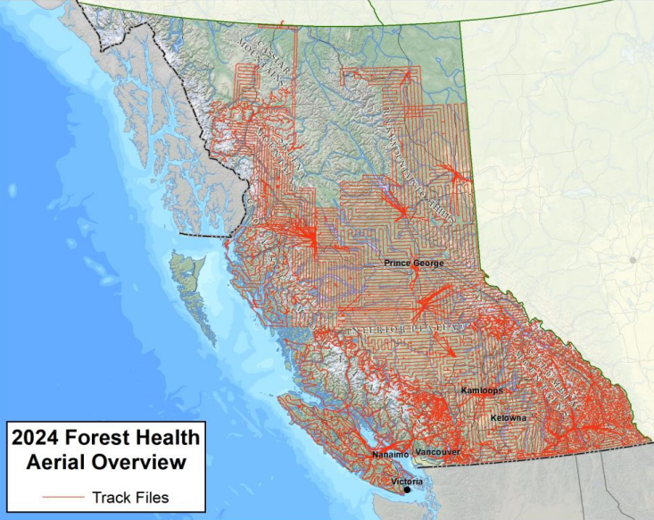

OVERVIEW
This repo is for Nico Trick's Master of Geomatics for Environmental Management (UBC) Capstone Project. 
Here I explore how remote sensing can be used to monitor pest infestation in the Skeena Region of British Columbia

DATA RESOURCES
This project uses publicly available data from the Government of British Columbia. 
Pest Infestation Points: https://catalogue.data.gov.bc.ca/dataset/pest-infestation-points
Aerial Overview Survey Dashboard: https://app.powerbi.com/view?r=eyJrIjoiNmRjNDYwNzMtNDJkYS00Njg1LWI1NzQtYWYwMGE1MTc2MzIyIiwidCI6IjZmZGI1MjAwLTNkMGQtNGE4YS1iMDM2LWQzNjg1ZTM1OWFkYyJ9

CONTACT
Nico Trick, MSc. || ntrick8@student.ubc.ca

COLLABORATORS
Celia Boone, Ph.D., P.Ag || Research Forest Entomologist, Skeena Region || BC Ministry of Forests
Allan Carroll, Ph.D. || Professor; Director, Forest Sciences Undergraduate Program || Department of Forest and Conservation Sciences; University of British Columbia
Kate Mitchell, Ph.D. || Provincial Entomologist || BC Ministry of Forests